# Kolors-LoRA Style Story Challenge–AIGC Direction

**Language**

[English](./README-EN.md)     [中文](./README.md)

# 1. Project Introduction

This project is the entry code for the **Kolors-Lora Style Story Challenge - AIGC Track**.

This project aims to demonstrate how gradient checkpointing and classifier-free guidance can significantly enhance both the image quality and the narrative coherence when generating art through diffusion-based models. 

We offer an end-to-end workflow—from data collection and preprocessing, through LoRA (Low-Rank Adaptation) training for style specialization, to final aesthetic evaluation—that participants can adopt or modify for their own creative or research purposes.

[Competition Link](https://tianchi.aliyun.com/s/ce4dc8bf800db1e58d51263ff357d28f)

### Key Goals

1. **High-Quality Image Generation**
   By integrating LoRA with the Kolors text-to-image diffusion model, the project shows how large-scale AI art generators can be fine-tuned to specific art styles or storytelling requirements while retaining high visual fidelity.
2. **Enhanced Storytelling Coherence**
   The project includes a multi-image storytelling pipeline, illustrating how AI-generated visuals can follow narrative arcs—from setting to climax to resolution—using carefully designed prompts and negative prompts.
3. **Practical, End-to-End Workflow**
   We offer sample scripts and guidance on crucial stages: data preprocessing with Data-Juicer, LoRA training using the DiffSynth-Studio framework, and multi-step inference for generating story sequences in ComfyUI. The workflow is designed to be reproducible, customizable, and easy to extend with additional nodes or modules.

### Technical Highlights

1. **Kolors Model**
   Developed by Kuaishou’s “Ket Tu” (Kolors) team, **Kolors** is a large-scale latent diffusion model trained on billions of text-image pairs. It excels at producing visually pleasing and semantically rich images, especially for Chinese-language prompts, but it also supports English text generation.
2. **Gradient Checkpointing**
   This technique reduces GPU memory consumption during training by selectively caching certain activations, allowing the training of larger models or larger mini-batches without major hardware upgrades.
3. **Classifier-Free Guidance**
   By adjusting the classifier-free guidance scale (CFG scale), the user can fine-tune the influence of the text prompt on the final image. Higher guidance emphasizes prompt fidelity, while lower guidance allows more creative or unexpected outputs.
4. **LoRA Training**
   - **Low-Rank Adaptation** modifies only small, low-rank matrices in the original diffusion model layers.
   - This approach is extremely parameter-efficient, preserving most of the original model’s weights while adapting it to new styles or domains.
   - Fine-tuning speed and lower memory overhead make it an ideal solution for customizing large diffusion models.
5. **Prompt Design & Negative Prompts**
   The project provides detailed prompt examples illustrating how subject descriptions, stylistic hints, and negative prompts (undesired attributes like “low quality” or “cropped”) work together to shape high-quality, thematically cohesive results.
6. **Data Preprocessing & Aesthetic Evaluation**
   - **Data-Juicer**: A robust toolchain for filtering, labeling, and augmenting images. It can handle tasks like removing low-resolution data or auto-generating textual descriptions for training.
   - **Aesthetic Score**: Leveraging a pretrained aesthetics predictor to exclude subpar images and guarantee consistent style and quality.


## 1.1 Results Demonstration

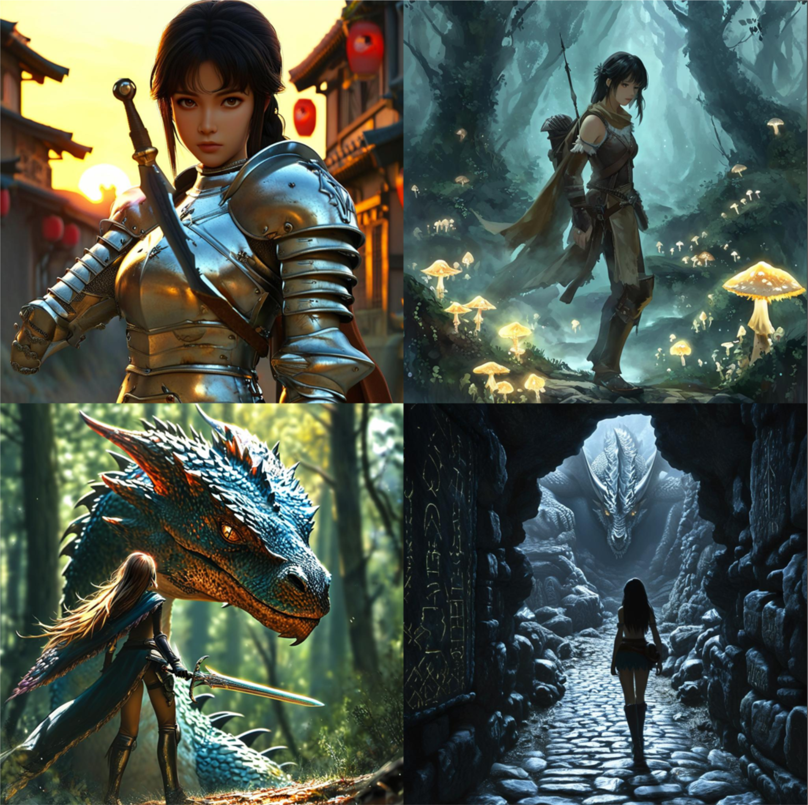


## 1.2 Prompt

### 1.2.1 Components

Subject description, detail description, modifiers, art style, artist

**[Prompt]**
 Beautiful and cute girl, smiling, 16 years old, denim jacket, gradient background, soft colors, soft lighting, cinematic edge lighting, light and dark contrast, anime, super detail, 8k

**[Negative prompts]**
 (lowres, low quality, worst quality:1.2), (text:1.2), deformed, black and white, disfigured, low contrast, cropped, missing fingers

### 1.2.2 Subject Description

**[Prompt]**
 Beautiful and cute girl, smiling, 16 years old, denim jacket, gradient background, soft colors, soft lighting, cinematic edge lighting, light and dark contrast, anime, super detail, 8k

**[Negative Prompt]**
(Low resolution, low quality, worst quality :1.2), (text :1.2), Distortion, black and white, damage, low contrast, cropping, missing finger

```
Heroic female warrior in the center of an ancient village, wearing shining silver armor and holding a sword, ready to set off. Her gaze is resolute; behind her is a sky with a rising sun. High-definition details, dynamic lighting. High-precision 3D rendering. Hayao Miyazaki style

low resolution, text overlay, distorted forms, low contrast, black and white

The female warrior crosses a forest filled with mystery, surrounded by mist and glowing mushrooms. She carefully avoids traps in the forest. Dreamlike colors, soft lighting. Digital watercolor. Gu Tingye style.

Blurry image, color distortion, noisy frame

Deep in the forest, the female warrior faces a guardian dragon; its scales reflect dazzling light in the sunlight. She charges forward with her sword. Fine textures, motion blur. Surrealism. Salvador Dalí style.

Static scene, blurred action, too dark

Discovering a hidden passage leading to the dragon’s lair, the female warrior silently proceeds along the stone passage, whose walls are engraved with ancient runes. A sense of history, dim lighting. Gothic style. Tim Burton style.

Missing details, oversaturated colors

Reaching the dragon’s lair, the cave ablaze with flames, the giant dragon awakens in the lava, preparing to fight. Flame effects, high contrast. Animation style. Makoto Shinkai style

Monochromatic colors, bland visuals

A fierce battle unfolds: the female warrior uses her agility to dodge the dragon’s fiery attacks, the tip of her sword gleaming coldly in counterattacks. Warm lighting, delicate expressions. Classical oil painting. Francisco Goya style

Stiff expression, insufficient light

After the dragon falls, the female warrior frees the chained princess. The princess, dressed in a tattered gown, sheds tears of joy as she expresses her gratitude. Warm lighting, delicate expressions. Classical oil painting. Francisco Goya style

Stiff expression, insufficient light

The female warrior and the princess ride back to the village on a white horse, with villagers cheering and celebrating along the way and petals falling from the sky. The scene is festive. Holiday atmosphere, soft filters. Romanticism. John Constable style

Crowded scene, clashing colors
```

## 1.3 Further Results Demonstration

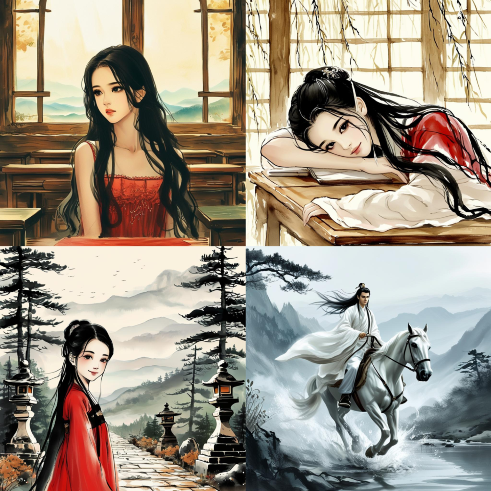

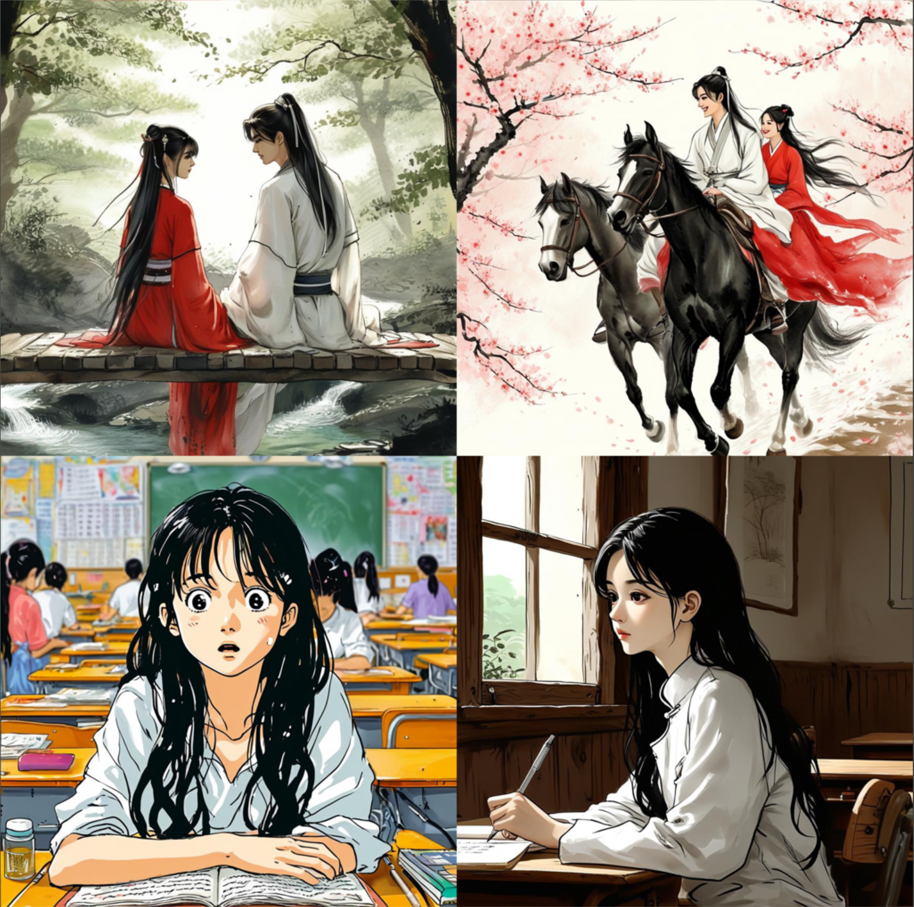

## 1.4 Prompts

| **Image #** | **Scene Description**                                     | **Positive Prompt**                                          |
| ----------- | --------------------------------------------------------- | ------------------------------------------------------------ |
| Image 1     | The heroine is in class                                   | Traditional style, ink painting style, a black-haired girl sitting at an ancient wooden desk, the classroom is filled with light, and mountains are faintly visible outside the window. The girl wears a delicate red gown, upper body, listening attentively, eyes focused. |
| Image 2     | She begins to doze off                                    | Traditional style, ink painting style, a black-haired girl lying on a wooden desk, her head resting on her arms, looking peaceful, red gown draped lightly over her back, quiet classroom, willows swaying outside the window. |
| Image 3     | She falls asleep and dreams of standing beside a roadside | Traditional style, ink painting style, a black-haired girl standing on a picturesque ancient road, flanked by ancient pine trees and stone lanterns, wearing a red dress, smiling, distant hazy mountains, upper body. |
| Image 4     | A prince rides by on horseback                            | Traditional style, ink painting style, a handsome prince in a white robe, riding a white horse along a mountain path, with beautiful scenery of mountains and flowing water in the background, water splashing under the horse’s hooves, full body. |
| Image 5     | The two have a pleasant conversation                      | Traditional style, ink painting style, a handsome young man and a black-haired girl sitting on an ancient bridge under the shade of trees, a clear stream flowing beneath them, facing each other with emotive eye contact, dressed in traditional attire, red dress for the girl, white robe for the young man, upper body. |
| Image 6     | They ride together on horseback                           | Traditional style, ink painting style, the handsome young man and the long-haired girl riding a horse together along an ancient path lined with cherry blossoms, both smiling and chatting, his white robe fluttering, her red skirt swaying, full body. |
| Image 7     | Class ends, and she wakes up                              | Traditional style, ink painting style, a black-haired girl sitting at her desk with wide-open eyes, startled from her dream, the classroom now has more activity from her classmates, background includes other desks and study materials, upper body. |
| Image 8     | Back to school life again                                 | Traditional style, ink painting style, a black-haired girl sitting at a wooden desk, concentrating on the blackboard, holding writing tools, the classroom is simply decorated, the view outside the window is calm, upper body. |

| **Image #** | **Scene Description**                              | **Positive Prompt**                                          | **Negative Prompt**                         |
| ----------- | -------------------------------------------------- | ------------------------------------------------------------ | ------------------------------------------- |
| Image 1     | The heroine is in class                            | Traditional style, ink painting style, a black-haired girl, sitting in the classroom, staring at the blackboard, deep in thought, upper body, red dress | Ugly, deformed, noisy, blurry, low contrast |
| Image 2     | She begins to doze off                             | Traditional style, ink painting style, a black-haired girl, sitting in the classroom, lying on the desk asleep, upper body, red dress | Ugly, deformed, noisy, blurry, low contrast |
| Image 3     | Falls asleep, dreams of standing beside a roadside | Traditional style, ink painting style, a black-haired girl, standing by the roadside, upper body, red dress | Ugly, deformed, noisy, blurry, low contrast |
| Image 4     | The prince rides up on horseback                   | Traditional style, ink painting style, a handsome young man, riding a white horse, upper body, white shirt | Ugly, deformed, noisy, blurry, low contrast |
| Image 5     | The two have a pleasant conversation               | Traditional style, ink painting style, a handsome young man, white shirt, a black-haired girl, red dress, both chatting happily, upper body | Ugly, deformed, noisy, blurry, low contrast |
| Image 6     | They ride together on horseback                    | Traditional style, ink painting style, a handsome young man, white shirt, a black-haired girl, red dress, both riding a horse together, full body | Ugly, deformed, noisy, blurry, low contrast |
| Image 7     | Class ends, and she wakes up                       | Traditional style, ink painting style, a black-haired girl, sitting in the classroom, the class bell rings, classmates start moving around, wakes from sleep, deep in thought, upper body, red dress | Ugly, deformed, noisy, blurry, low contrast |
| Image 8     | Back to school life again                          | Traditional style, ink painting style, a black-haired girl, sitting in the classroom, staring at the blackboard, paying serious attention, upper body, red dress | Ugly, deformed, noisy, blurry, low contrast |

# 2. Introduction

## 2.1 Kolors Model

The Kolors model is a large-scale latent diffusion-based text-to-image generation model developed by the Kuaishou “Ket Tu” (Kolors) team.

Trained on billions of text-image pairs, **Kolors** demonstrates significant advantages over other open-source/closed-source models in visual quality, complex semantic understanding, and text generation (Chinese/English characters). It supports both Chinese and English, with particularly strong capabilities for Chinese content.

For more experimental results and details, please see the [Technical Report](https://github.com/Kwai-Kolors/Kolors/blob/master/imgs/Kolors_paper.pdf).

## 2.2 AI Image Generation

AI image generation (AI-generated images, AI painting) refers to using artificial intelligence to generate visual works that match input text, sketches, or images. This technology combines **deep learning, computer vision, and natural language processing**, enabling the creation of high-quality images widely used in **art, advertising, game development, and film production**.

**GANs (Generative Adversarial Networks)**
 Generates images by pitting two neural networks (generator and discriminator) against each other, continuously refining the image quality. Examples include:

- **StyleGAN** (developed by NVIDIA, can generate highly realistic human faces)
- **BigGAN** (generates high-resolution images across multiple categories)

**Diffusion Models**
 Generates high-quality images by iteratively denoising. Most mainstream AI painting models use this technology:

- **Stable Diffusion** (open-source, can be run locally, widely applied)
- **DALL·E** (developed by OpenAI, generates creative images from text)
- **MidJourney** (popular in artistic creation, strong stylization)

**Variational Autoencoders (VAEs)**
 Used for dimensionality reduction and image generation, e.g., **VQ-VAE** for producing high-resolution images.

**CLIP (Contrastive Language-Image Pretraining)**
 Developed by OpenAI, it understands the relationship between text and images, helping AI generate more accurate images based on textual prompts.

### Common AI Image Generation Tools

| Tool Name            | Key Features                                             | Use Cases                            |
| -------------------- | -------------------------------------------------------- | ------------------------------------ |
| **Stable Diffusion** | Open-source, supports local deployment, abundant plugins | Personal creation, commercial design |
| **DALL·E 2**         | Developed by OpenAI, excels in detail & creativity       | Advertising, illustration            |
| **MidJourney**       | Strong stylization, community-driven                     | Artworks, concept design             |
| **Runway ML**        | Web-based, suitable for video creation                   | Short videos, film production        |
| **Deep Dream**       | Developed by Google, dream-like style                    | Abstract art                         |
| **Artbreeder**       | Genetic mix AI painting                                  | Avatar design, character creation    |

### 2.2.1 Difficulties and Challenges

**1. Hands**: Handling accuracy of human hands—some solutions involve marking the palm, thumb, index finger, etc., to clarify their structure.

**2. AI’s “Understanding”**: AI image models learn the **correspondences** between text descriptions and **image features**, storing them in their memory. Whether AI truly “understands” the underlying real-world features remains a point of debate in both academia and industry. Different models have limited and varied training data, leading to discrepancies in style and specific subjects, sometimes generating unrealistic results.

**3. The “AI feel”**: AI-generated images often exhibit a sense of “uncanny mismatch” compared to real-life scenes or human-created art/photography/3D work, sometimes due to detail inaccuracies or logical inconsistencies. Clues that an image might be AI-generated include:

- **Examining details**: Carefully check facial features, especially eyes and mouth.
- **Checking light and shadows**: Analyze whether the light source is consistent, if shadow directions match, whether there’s unnatural lighting or shadow.
- **Analyzing pixels**: Zoom in to see if there are blurry or pixelated parts.
- **Observing background**: Check for inconsistencies like unnatural object edges or repetitive patterns.

### 2.2.2 Introduction and Analysis of Generation Techniques

1. **Fundamental Text-to-Image Model Optimizations**
   - **DALLE-2**
      DALLE-2 is an advanced AI model developed by OpenAI for generating images from textual descriptions. It’s part of a broader class of "large language models" extended to visual content based on natural language inputs. DALLE-2 uses deep learning to create images matching detailed prompts, producing creative, high-quality visuals. It finds applications in art/design ideation, advertising, and storytelling.
   - **Stable Diffusion**
      Stable Diffusion is a deep learning model that creates high-quality images from text descriptions. It is open-source and powered by latent diffusion models. Users can steer image generation via detailed prompts or by tuning parameters. Its flexibility and large open-source community make it popular for artistic and creative pursuits.
   - **Diffusion Transformer**
      Diffusion Transformers combine diffusion models and transformer architectures to produce high-quality images from text. Diffusion models convert random noise into coherent images step by step, while transformers excel at language understanding, sequence modeling, and representational power.
2. **Controllable Generation & Image Editing**
   - **ControlNet**
   - **T2I-Adapter**
   - **Dreambooth**
3. **Accelerated Sampling**
   - **DDIM**
   - **Consistency Model**
   - **Rectified Flow**

## 2.3 ComfyUI Text-to-Image Workflow

### 2.3.1 What Is ComfyUI?

“GUI” stands for “Graphical User Interface”—the kind of interface on a computer with **icons, buttons, and menus**.

**ComfyUI** is a GUI system for controlling image-generation processes in a modular, node-based style—similar to a flowchart—allowing flexible control of image creation.

### 2.3.2 Core ComfyUI Modules

1. **Model Loader**: Loads the base model file (Model: .safetensors, etc.).

2. **Prompt Manager**: CLIP (Contrastive Language–Image Pre-training)
    Converts text into embeddings the model can understand. “Latent space” embeddings compress high-dimensional information into a lower-dimensional space.

3. Sampler

   : Controls how the model generates images. Different sampling parameters affect final image quality and diversity. Stable Diffusion fundamentally denoises random noise into coherent images.

   - *seed*: random seed for noise generation
   - *control_after_generate*: determines changes to seed after each generation
   - *steps*: number of denoising iterations (more steps = better quality but longer generation time)
   - *cfg*: classifier-free guidance scale, controlling how strongly the prompt influences image generation. Higher values = images more aligned to the prompt.
   - *denoise*: how much content gets overwritten by noise
   - *sampler_name*, *scheduler*: additional denoising parameters

4. Decoder

   : VAE Decoder

   A Variational Autoencoder (VAE) is a generative model. VAE has two parts:

   - **Encoder**: maps the input data to a latent space, learning mean (μ) and variance (σ2).
   - **Decoder**: reconstructs the data from samples in the latent space.

## 2.4 LoRA Fine-Tuning

### 2.4.1 What Is LoRA?

LoRA (Low-Rank Adaptation) fine-tuning is a technique for efficiently adapting a pretrained model by adding low-rank matrices in key layers. This allows quick and flexible model customization for specific tasks or domains with fewer resources.

### 2.4.2 How LoRA Works

LoRA inserts low-rank matrices into the pretrained model’s critical layers. These low-rank matrices have fewer parameters, so only they are updated during training while most original model weights remain unchanged.

### 2.4.3 Advantages of LoRA

- **Fast Adaptation to New Tasks**
   With only small sets of labeled data, LoRA can effectively tailor a model to a new domain or specific task.
- **Maintains Generalization**
   By tuning only parts of the model, LoRA preserves general performance on unseen data while learning new domain-specific knowledge.
- **Resource Efficiency**
   LoRA significantly reduces the compute and storage overhead, as it trains only a small portion of model parameters.

### 2.4.4 LoRA Details

| **Parameter**                  | **Value**                                                    | **Description**                                              |
| ------------------------------ | ------------------------------------------------------------ | ------------------------------------------------------------ |
| `pretrained_unet_path`         | models/kolors/Kolors/unet/diffusion_pytorch_model.safetensors | Path to the pretrained **UNet**                              |
| `pretrained_text_encoder_path` | models/kolors/Kolors/text_encoder                            | Path to the pretrained **text encoder**                      |
| `pretrained_fp16_vae_path`     | models/sdxl-vae-fp16-fix/diffusion_pytorch_model.safetensors | Path to the pretrained **VAE**                               |
| `lora_rank`                    | 16                                                           | Rank for LoRA, affecting complexity and performance          |
| `lora_alpha`                   | 4                                                            | Alpha value for LoRA, controlling the intensity of fine-tuning |
| `dataset_path`                 | data/lora_dataset_processed                                  | Path to the training dataset                                 |
| `output_path`                  | ./models                                                     | Path to save the model after training                        |
| `max_epochs`                   | 1                                                            | Maximum training epochs                                      |
| `center_crop`                  |                                                              | Enables center cropping for image preprocessing              |
| `use_gradient_checkpointing`   |                                                              | Enables gradient checkpointing to save GPU memory            |
| `precision`                    | “16-mixed”                                                   | Uses mixed 16-bit precision (half precision) during training |

## 2.5 Preparing the Dataset

### 2.5.1 Define Your Requirements and Goals

- **Application Scenario**: e.g., artistic style transfer, product image generation, medical imaging, etc.
- **Data Type**: Real-world photos or synthetic images? Black-and-white or color? High or low resolution?
- **Data Volume**: How many images do you need for training and validation?

### 2.5.2 Sources and Organization

| **Source Type**                | **Recommendation**                                           |
| ------------------------------ | ------------------------------------------------------------ |
| **Open Data Platforms**        | The ModelScope community offers nearly 3000 open datasets across text, image, audio, video, and multimodal scenarios. You can explore them with the left sidebar’s tags. Check if there’s something you need. [Link](https://www.modelscope.cn/datasets?Tags=object-tracking&dataType=video&page=1) Other suggestions:- [ImageNet](http://image-net.org/)- [Open Images](https://storage.googleapis.com/openimages/web/index.html)- [Flickr (Flickr30k/Flickr8K)](https://github.com/haltakov/flickr30k-dataset)- [CelebA](http://mmlab.ie.cuhk.edu.hk/projects/CelebA.html)- [LSUN](https://www.yf.io/p/lsun) |
| **Using APIs or Web Crawlers** | Use APIs from stock photo sites (e.g., Unsplash, Pexels) or crawler tools for specific content. Mind copyrights! |
| **Data Synthesis**             | Use game engines (e.g., Unity, Unreal Engine) or specialized software to create synthetic data. For instance, Datawhale and Alibaba Cloud Tianchi have a full set of tutorials on multi-modal large model data synthesis—[From Zero to Multi-modal LLM Data Synthesis](https://datawhaler.feishu.cn/wiki/PVmkwDClQiKbmOk1e7scYo2Pndd?fromScene=spaceOverview). |
| **Data Augmentation**          | For smaller datasets, apply transformations such as rotation, flipping, scaling, color changes, etc. |
| **Purchase or Customization**  | For specialized areas (e.g., medical imaging, satellite imagery), consider buying datasets from reliable channels. |

# 3. Competition Details

1. Participants must train a LoRA model based on the Kolors model to generate unlimited styles (e.g., ink painting, watercolor, cyberpunk, anime style, etc.).
2. Generate 8 images to form a coherent story. The story content can be defined freely.
3. Evaluate the aesthetic appeal and coherence of the 8-image story based on the LoRA style.

### Example: Idol Girl Development Diary

| A little girl sits on a sofa feeling bored                   | The girl arrives at a concert and is attracted by her idol sister | The girl shows a look of admiration                          | After the concert, a dream of becoming an idol takes root in the girl’s heart |
| ------------------------------------------------------------ | ------------------------------------------------------------ | ------------------------------------------------------------ | ------------------------------------------------------------ |
| 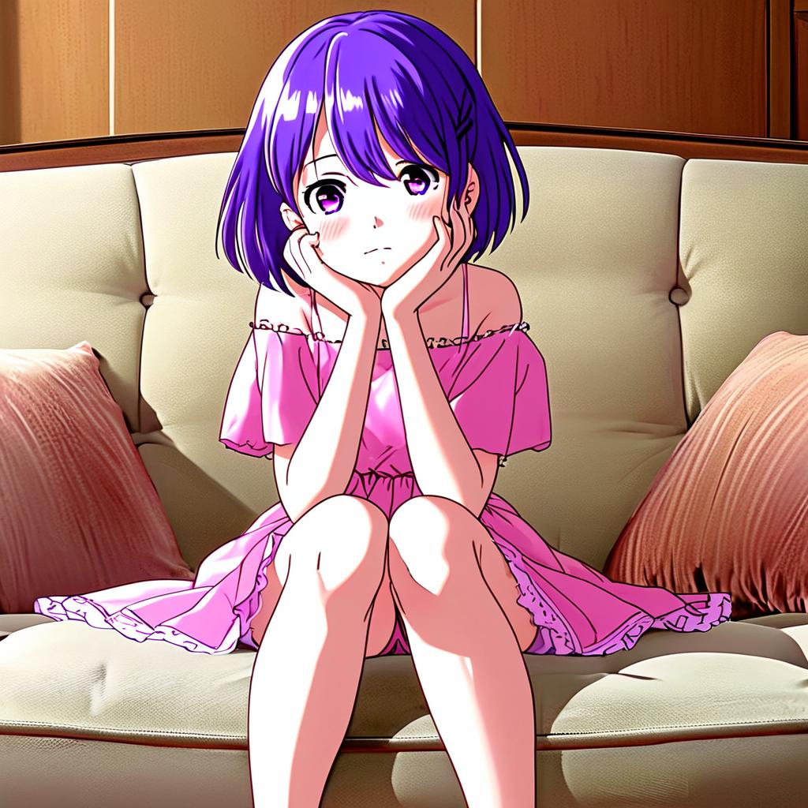 | 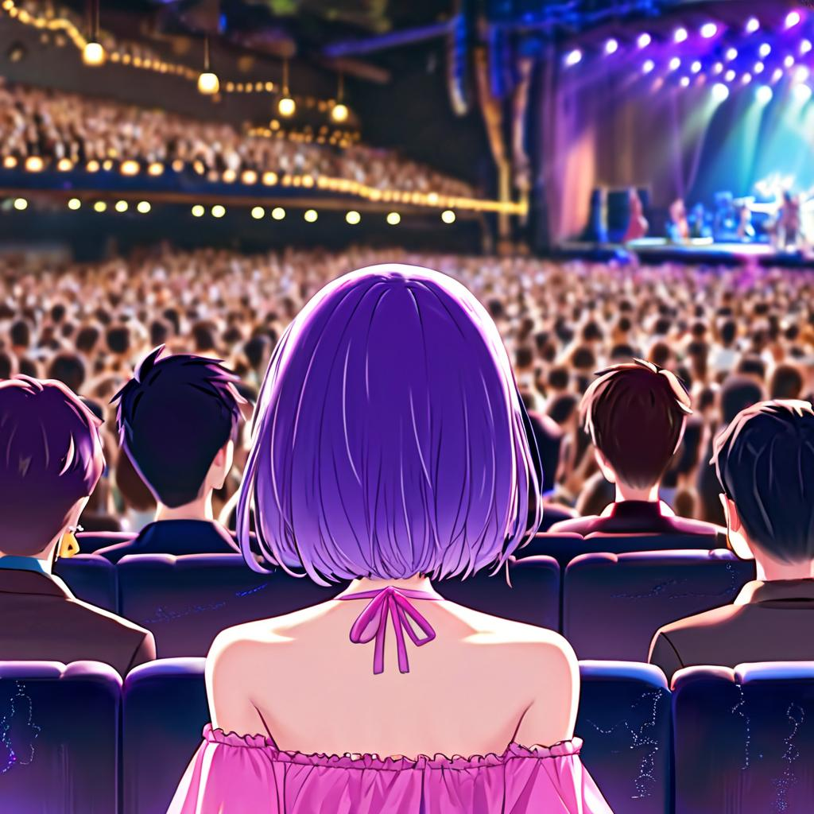 | 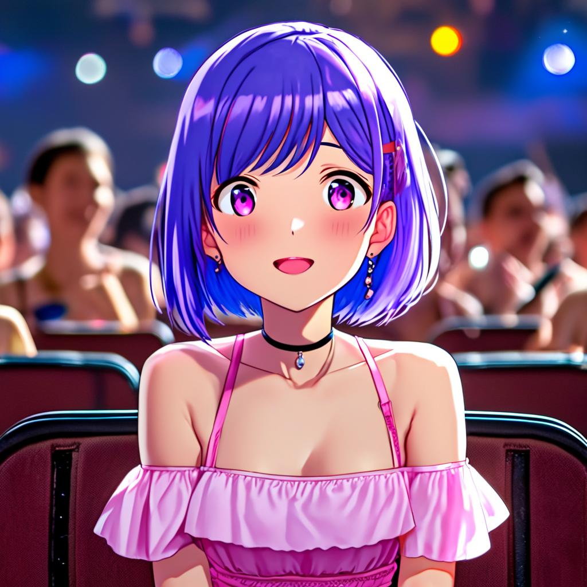 | 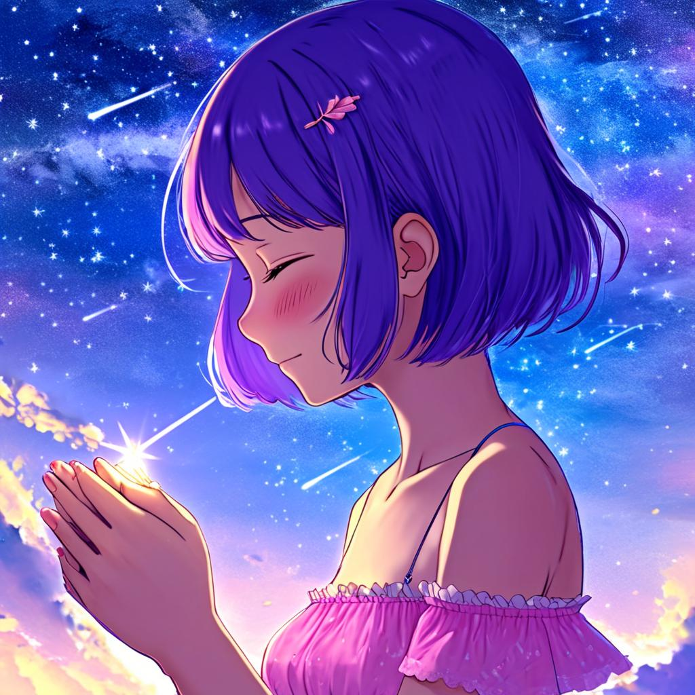 |

| To become an idol, the girl practices singing day after day  | Seasons pass, and the girl grows up to be the image she once admired | Finally, she is about to perform on stage for the first time, wearing a black dress, feeling nervous | Under the spotlight, she sings her heart out, the shimmering dream becoming reality |
| ------------------------------------------------------------ | ------------------------------------------------------------ | ------------------------------------------------------------ | ------------------------------------------------------------ |
| 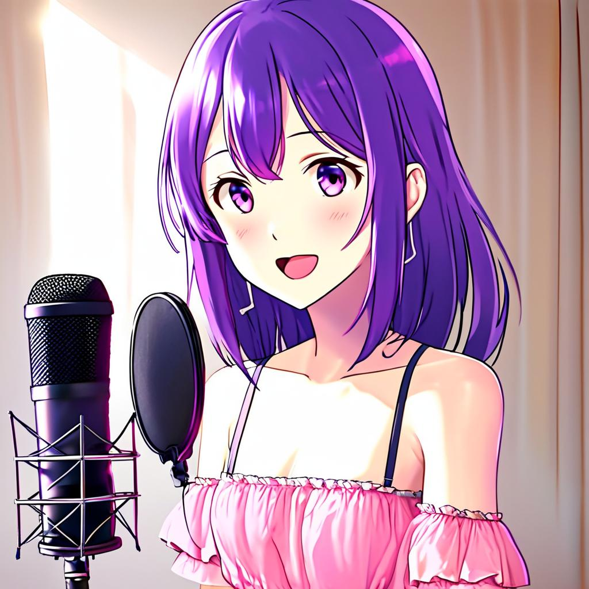 | 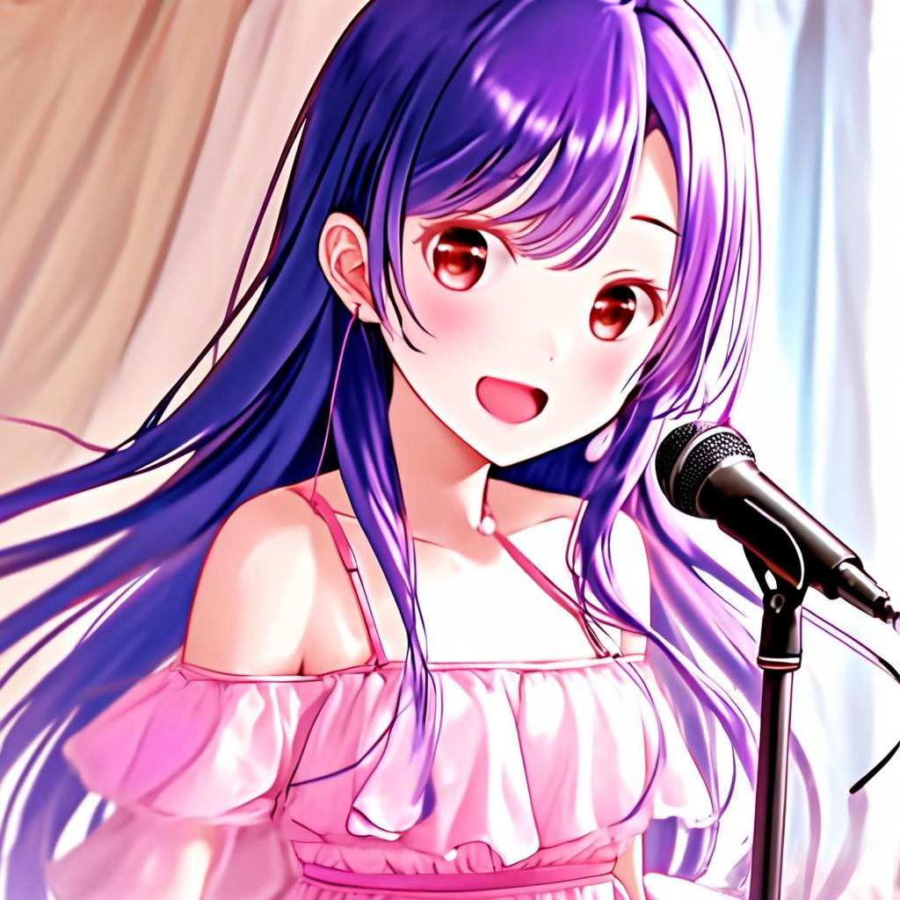 | 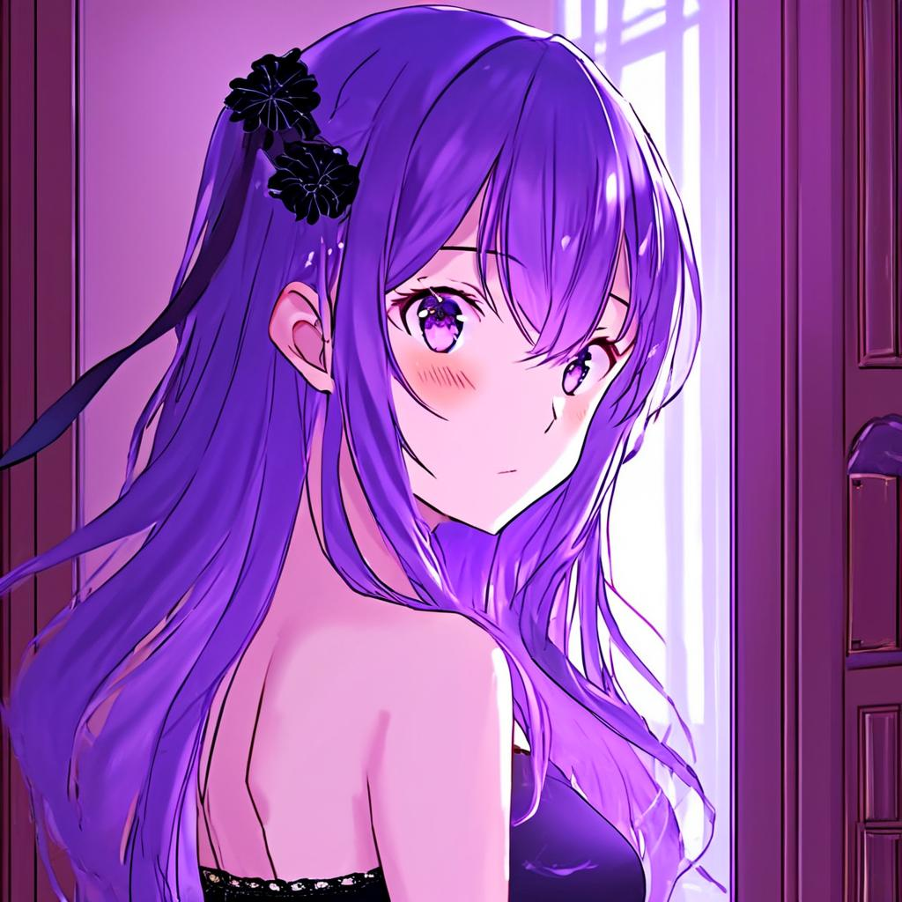 | 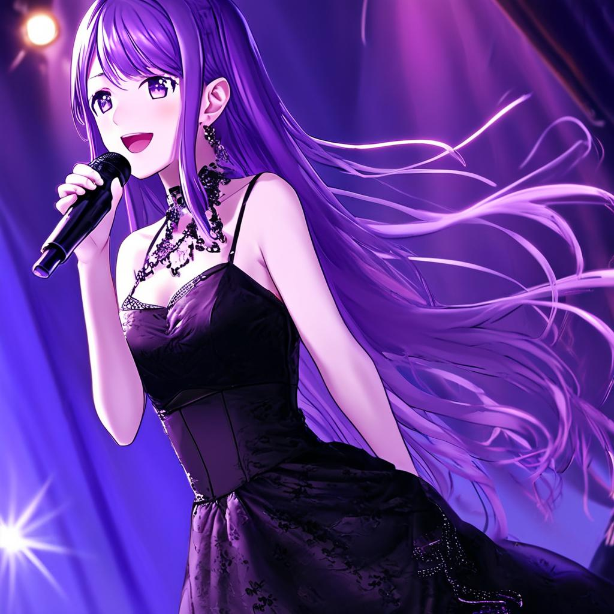 |

## 3.1 Training and Inference Tools

We provide the necessary LoRA training and inference support for competitors. The training framework is powered by the open-source project **DiffSynth-Studio**.

> [DiffSynth-Studio](https://github.com/modelscope/DiffSynth-Studio) is an open-source diffusion engine aiming to integrate various diffusion-based image and video models (Stable Diffusion, ControlNet, AnimateDiff, IP-Adapter, DiT, Kolors, ExVideo, etc.) into one platform. It provides an easy-to-use training framework, making it simple to do LoRA training for Kolors and other models.

For data preprocessing, we provide sample code using **Data-Juicer** in the notebook. Participants can use it as a reference to carefully process their image datasets.

> [Data-Juicer](https://github.com/modelscope/data-juicer) is a one-stop multimodal data processing system designed for large-model training. For image processing, Data-Juicer offers a rich set of operators such as automated image annotation, harmful content detection/filtering, watermark detection, and aesthetic scoring. Users can conveniently use Data-Juicer to process and filter images for high-quality training data to achieve stunning generation results.

For computing resources, participants can use the free GPU instances provided by the ModelScope community. Choose the pre-installed image “ubuntu22.04-cuda12.1.0-py310-torch2.3.0-tf2.16.1-1.16.1” in “My Notebook” to run our provided notebooks online.

During inference, we also provide **ComfyUI** support. Competitors can build workflows in ComfyUI to generate images.

**Potential ways to improve image quality**:

- Use high-quality datasets:
  - Filter out low-aesthetic images using image aesthetic evaluation
  - Generate descriptive texts for images to strengthen text-image alignment
- Adjust training parameters:
  - For LoRA training of a **specific style**, a higher rank (e.g., 16) sometimes yields better results
  - For LoRA training of a **specific entity**, a smaller rank (e.g., 4) can be more stable
- Build a stronger workflow, such as:
  - Generating lower-resolution images first and then refining them to high resolution in a two-stage generation process

**File Descriptions**:

- `baseline.ipynb`: LoRA training script
- `ComfyUI.ipynb`: ComfyUI script
- `kolors_example.json`: ComfyUI workflow (no LoRA)
- `kolors_with_lora_example.json`: ComfyUI workflow (with LoRA)

## 3.3 Schedule

- **Registration & Team Formation**: Now – August 31, 2024, 23:59

  1. Register via the Tianchi platform and ensure your registration info is valid. Otherwise, you may be disqualified.

  2. You can participate as an individual or as a team (max 5 members per team). Each person can join only one team. If it’s a team, please designate a team leader to handle communications.

  3. All participants must complete 

     real-name verification

      on Tianchi by August 31, 23:59. Teams that fail to complete verification will be disqualified.

     - Each team member (including the leader) must complete real-name verification, or the team won't be considered verified.

- **Preliminary Round**: Registration – August 31, 2024, 23:59

- **Finalist Notification**: September 2, 2024
   From all preliminary submissions, 30 teams will advance to finals (determined by judges + public voting).

- **Finals**: September 9, 2024, 14:00–17:00 (online defense). The top three prizes will be awarded based on judges’ scores.

- **Awards**: September 19–21, 2024, at the offline Yunqi Conference (Cloud Summit) ceremony and exhibition.

## 3.4 Submission of Works

After registering on the Tianchi platform, participants must submit results on the ModelScope platform:

1. Upload your trained LoRA model to the [ModelScope Model Hub](https://modelscope.cn/aigc/models?name=Kolors-LoRA-example-anime&page=1)
   - Name your LoRA model as: **TeamName-KolorsTraining-xxxxxx**
   - Upload link for LoRA: [Create Model Page](https://modelscope.cn/models/create?template=text-to-image-lora)
2. Post your project in the **competition brand zone discussion**: [Kolors Brand Page](https://modelscope.cn/brand/view/Kolors?branch=0&tree=11)
   - Title Format: **Tianchi Team Name + LoRA Model Link + Project Images (the 8-image story)**

## 3.5 Scoring

The competition uses an objective score to validate submission effectiveness, but final ranking is based on subjective judging.

### 1. Subjective Scoring

Judges will vote based on:

- **Technical Implementation (40%)**
- **Coherence of the 8-Image Series (30%)**
- **Overall Aesthetic (30%)**

### 2. Objective Scoring

We use an aesthetic score to filter invalid submissions. If the score is below 6 (subject to change by the organizer), the submission is considered invalid and does not proceed to subjective judging.

We will also verify participants’ uploaded model files. Participants must submit:

- LoRA model file
- Model introduction
- At least 8 generated images + corresponding prompts to enable reproducibility. If the provided images cannot be reproduced clearly, the prize qualification will be revoked.

### 3. Aesthetics Scoring

```python
pip install simple-aesthetics-predictor

import torch, os
from PIL import Image
from transformers import CLIPProcessor
from aesthetics_predictor import AestheticsPredictorV2Linear
from modelscope import snapshot_download


model_id = snapshot_download('AI-ModelScope/aesthetics-predictor-v2-sac-logos-ava1-l14-linearMSE', cache_dir="models/")
predictor = AestheticsPredictorV2Linear.from_pretrained(model_id)
processor = CLIPProcessor.from_pretrained(model_id)
device = "cuda"
predictor = predictor.to(device)


def get_aesthetics_score(image):
    inputs = processor(images=image, return_tensors="pt")
    inputs = {k: v.to(device) for k, v in inputs.items()}
    with torch.no_grad():
        outputs = predictor(**inputs)
    prediction = outputs.logits
    return prediction.tolist()[0][0]


def evaluate(folder):
    scores = []
    for file_name in os.listdir(folder):
        if os.path.isfile(os.path.join(folder, file_name)):
            image = Image.open(os.path.join(folder, file_name))
            scores.append(get_aesthetics_score(image))
    if len(scores) == 0:
        return 0
    else:
        return sum(scores) / len(scores)


score = evaluate("./images")
print(score)
```

# 4. Project Repository

1. Environment setup
2. Dataset loading and preprocessing
3. Data cleaning and filtering
4. CLIP model evaluation
5. PyTorch dataset and DataLoader
6. StableDiffusion image generation

# 5. Projet Execution

This project runs on the Alibaba Cloud PAI-DSW platform, requiring authorization from the ModelScope community.

**Environment Requirements**:

- `modelscope`, `data-juicer`, `diffsynth`, `peft`, `torch`, `tqdm`, `pandas`, `PIL`, etc., are installed.
- `dj-process` command is recognized in the current Python environment.
- If running in a container, ensure the container can access external networks to download models.

**Data Size**: For large datasets, `data-juicer` filtering may require significant time or disk space.

**Hyperparameter Adjustments**: Modify `--lora_rank`, `--lora_alpha`, `--precision`, `--max_epochs`, `--dataset_path`, `--output_path`, etc., based on actual needs and resources.

**Inference**: Ensure paths to checkpoints are correct and that LoRA rank/alpha match your training settings.

## 5.1 Download Kolors Training Dataset

```bash
git lfs install
git clone https://www.modelscope.cn/datasets/maochase/kolors.git
```

## 5.2 Python Environment

```bash
!pip install simple-aesthetics-predictor
!pip install -v -e data-juicer
!pip uninstall pytorch-lightning -y
!pip install peft lightning pandas torchvision
!pip install -e DiffSynth-Studio
```

## 5.3 Upload Results

```bash
mkdir /mnt/workspace/kolors/output
cd /mnt/workspace/kolors

cp /mnt/workspace/kolors/models/lightning_logs/version_0/checkpoints/epoch=0-step=500.ckpt /mnt/workspace/kolors/output/
cp /mnt/workspace/kolors/1.jpg /mnt/workspace/kolors/output/
```

**TeamName-KolorsTraining-xxxxxx**
 For example:
 `freshman2233-KolorsTraining-WarriorSlaysDragonAndSavesPrincess`

# 6. ComfyUI Execution

```bash
# Installs Git Large File Storage (LFS)
git lfs install

# Clones a Git repository from the provided URL.
git clone https://www.modelscope.cn/datasets/maochase/kolors_test_comfyui.git

# Moves contents from 'kolors_test_comfyui' into current directory.
mv kolors_test_comfyui/* ./

# Removes the now-empty directory.
rm -rf kolors_test_comfyui/

# Creates a directory for the model checkpoint.
mkdir -p /mnt/workspace/models/lightning_logs/version_0/checkpoints/

# Moves the checkpoint file.
mv epoch=0-step=500.ckpt /mnt/workspace/models/lightning_logs/version_0/checkpoints/
```


# License

This project is licensed under the MIT License - see the LICENSE file for details.

# References

```
[1] https://github.com/Kwai-Kolors/Kolors/tree/master
[2] Kolors: Effective Training of Diffusion Model for Photorealistic Text-to-Image Synthesis
[3] Latest Image Generation Technology Research Directions - Introduction & Analysis https://www.bilibili.com/video/BV1vT421k7Qc/
[4] https://www.modelscope.cn/headlines/article/537?from=blibli_video
```